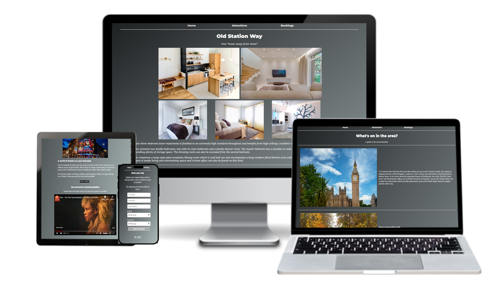
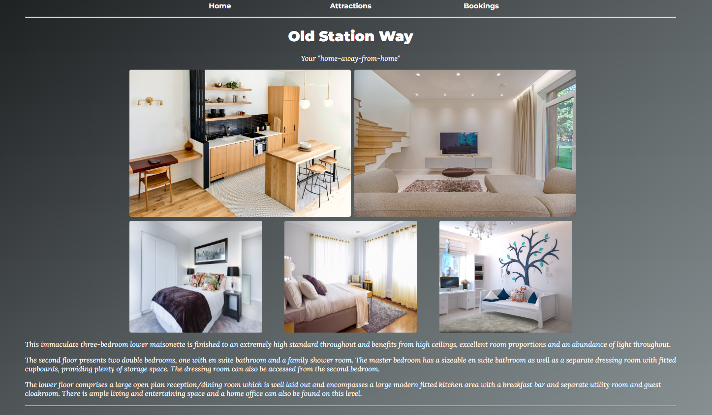
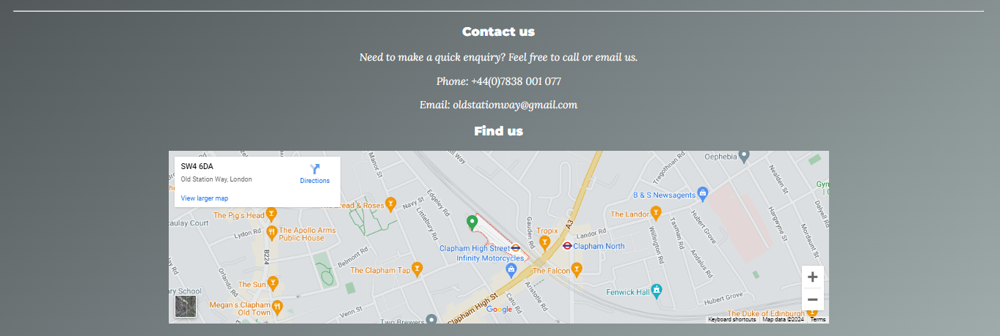
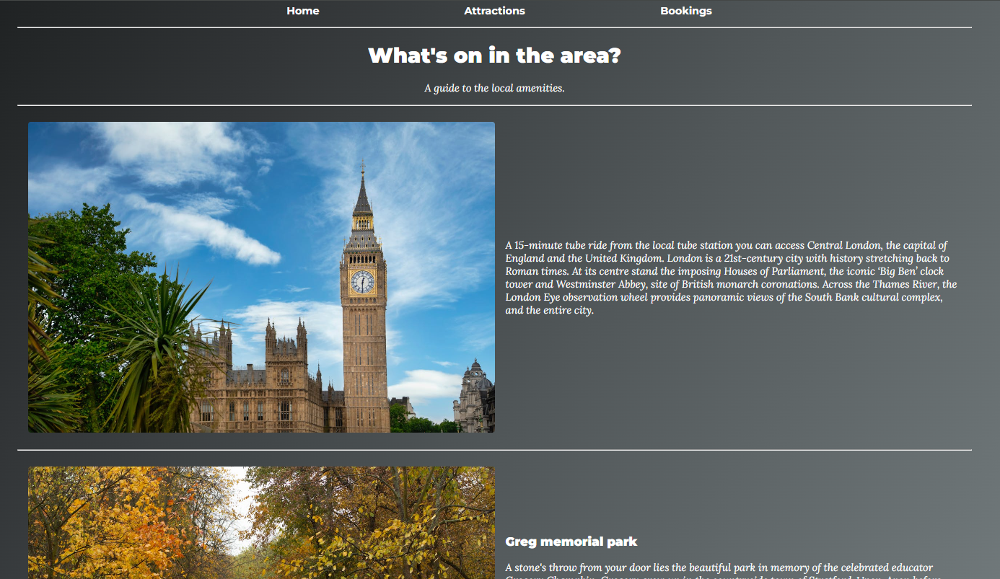
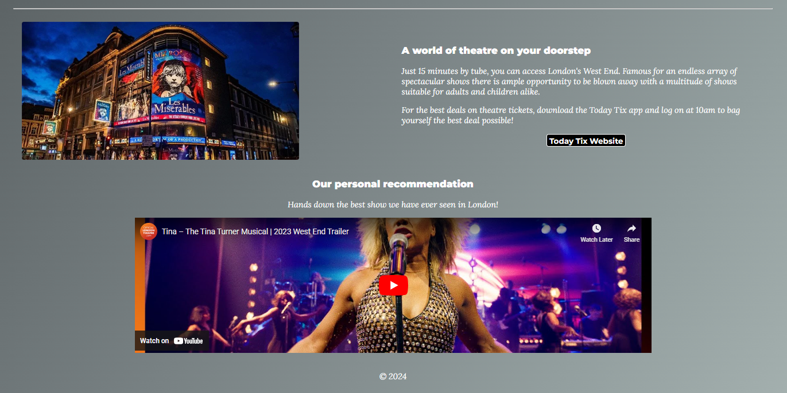
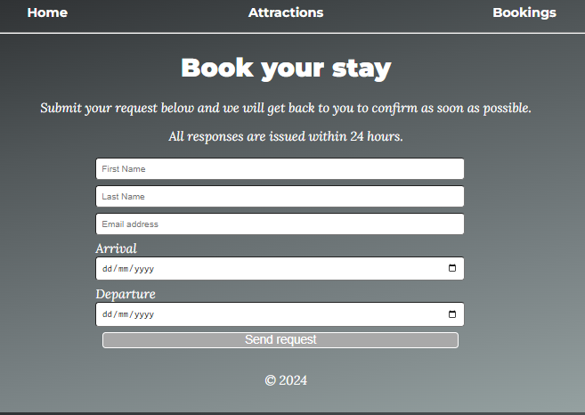

# Old Station Way

Old Station Way is a web page advertising a beautiful property to rent in a centralised location in London. The property is targeted towards a large group of people, be it a family or group of friends looking for a comfortable and cosy but stylish "home-away-from-home" when visiting London, UK. This site will be useful for visitors looking for simple property booking with added information on attractions and general things to do during their stay. 

## Features

### Navigation Bar

* The fully-functional navigation bar is featured on all 3 pages and includes a link to the Home page, Attractions and Bookings. 
* This section will allow the user to easily navigate from page to page without needing to use the 'back' button and is labelled to clearly show what information can be found on the other pages, enabling a positive and smooth user experience. 

### The Landing Page

* The landing page clearly shows the title of the website to begin with, being the street name of the property, as well as photographs of the rooms purposefully organised to allow the user to see immediately what the decor and size of rooms is like without the need to navigate to another page to see a Gallery. 
* This section includes information about the type of property that they are considering which involves key features that make it stand out from other rentals.

### Contact Us Section

* The Contact Us section is designed to clearly and simply provide contact information for ease of access and speedy communication. 
* Additionally a google map of the property location has been included below the contact information which is fully interactive for the user to be able to review the location of the property, as well as facilities in the vicinity. 
* The user will see the variety of facilities in the immediate area as well as the property's incredibly close proximity to the tube station as well as other transport links. 

### Footer

* The footer of the page simply features the copyright information and is present on all 3 pages.
* This shows the user that the information presented is both legitimate and up-to-date. 

### Attractions Page

* The Attractions page details useful information of key areas and things to do both in the vicinity of the property and also the main city. 
* This section is valuable to the user in providing quick information about key things to do local to the property and some breif information of other attractions they can plan into their itinerary, making the property stand out as a well-located, attractive option of a place to stay. 

### Attractions Page - Recommendations

* At the foot of the information on attractions in London, also featured is a useful link to a recommended theatre ticket retailer (which opens in a new tab for easier user navigation) as well as video of the trailer of the provider's recommended show. 
* This section adds a touch of personalisation and is considerate of the user's needs, offering an "above and beyond" approach to guest satisfaction.

### Booking Page

* The Booking page features an easy-to-read form which provides clarity on the information required to fill out in order to request a booking simply and efficiently. 
* This page is intended to meet user satisfaction by avoiding the required input of lots of information before the booking is confirmed. 

### Features Left to Implement

* For improvement of the site, features left to implement include the following: a gallery for further images of attractions/provisions in the local neighbourhood, a transport page for detailed information on local public transport, a live calendar showing the availability of the property along with pricings according to the time of year, social media links, and a reviews page for the user to see what previous visitors had to say about their stay. 

## Testing

## Validator Testing

### HTML

* Initially when passing the index.html (Landing Page) file through the official W3C Validator, it presented some warnings and a couple of errors regarding the code where I had mistakenly not removed elements of code that I had trialled in the development process. Thankfully these were minor and it did not take too much time to correct these and render the document with no errors. 
* When the attractions page was passed through the W3C Validator, there were numerous errors that were flagged due to the presence of span elements where they were not needed, again from previous stages of development. These were easy to rectify and had no impact on the overall rendering of the HTML document once corrected.
* The Bookings page only brought up a warning message due to my form sitting within a section without the presence of a heading. The section was therefore alteres to a div and resolved the issue. 

### CSS

* When passing through the official (Jigsaw) W3C Validator, 2 errors were found; one due to a single occurence of a british spelling of 'center' (centre), and the other due to a mis-application of the use of 'solid' as a value of 'border'. This was easily corrected as the styling had no impact on my chosen styles. 
* No other errors were found, but there was a warning that my font styles could not be checked due to being an import link from Google Fonts. 

## Unfixed Bugs

* There are no bugs left un-fixed as time has been taken to ensure the site runs smoothly.
* The primary shortcoming of this project was that it should have been developed for mobile first which would have made the process of ensuring reponsive design much simpler. However the project was developed for a desktop which meant that CSS media queries were complex to work out in order to make the different features scale down appropriately. As such the CSS code is seemingly large, however all attempts were made to simplify and minimise this as much as possible. 

## Deployment

## Credits

### Content

### Media