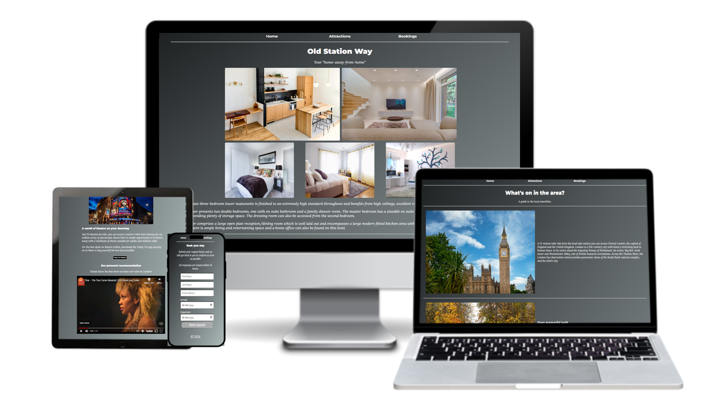
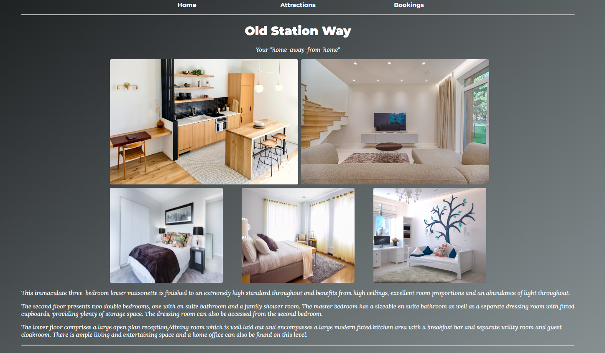
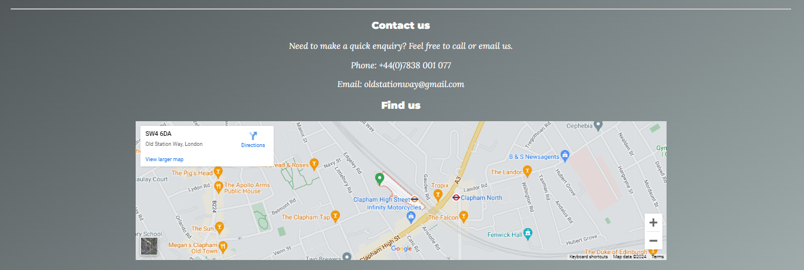
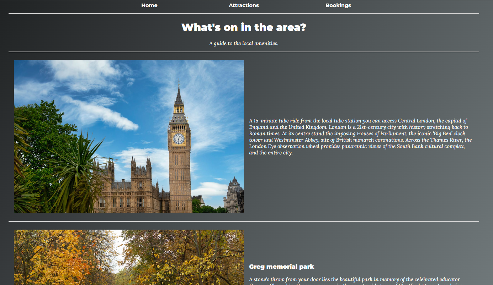
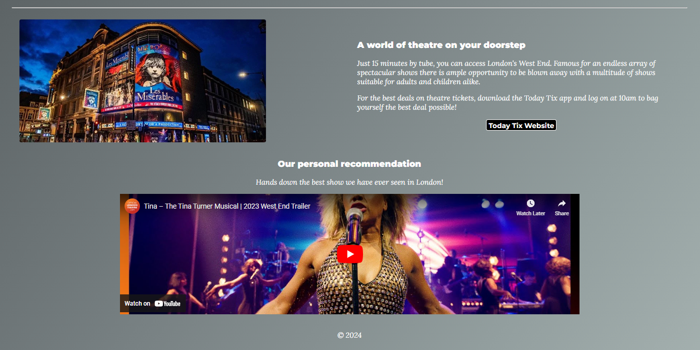
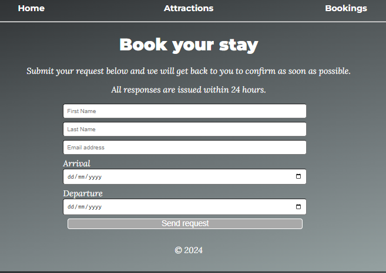

# Old Station Way

Old Station Way is a web page advertising a beautiful property to rent in a centralised location in London. The property is targeted towards a large group of people, be it a family or group of friends looking for a comfortable and cosy but stylish "home-away-from-home" when visiting London, UK. This site will be useful for visitors looking for simple property booking with added information on attractions and general things to do during their stay. 

## Features

### Navigation Bar

* The fully-functional navigation bar is featured on all 3 pages and includes a link to the Home page, Attractions and Bookings. 
* This section will allow the user to easily navigate from page to page without needing to use the 'back' button and is labelled to clearly show what information can be found on the other pages, enabling a positive and smooth user experience. 

### The Landing Page

* The landing page clearly shows the title of the website to begin with, being the street name of the property, as well as photographs of the rooms purposefully organised to allow the user to see immediately what the decor and size of rooms is like without the need to navigate to another page to see a Gallery. 
* This section includes information about the type of property that they are considering which involves key features that make it stand out from other rentals.

### Contact Us Section

* The Contact Us section is designed to clearly and simply provide contact information for ease of access and speedy communication. 
* Additionally a google map of the property location has been included below the contact information which is fully interactive for the user to be able to review the location of the property, as well as facilities in the vicinity. 
* The user will see the variety of facilities in the immediate area as well as the property's incredibly close proximity to the tube station as well as other transport links. 

### Footer

* The footer of the page simply features the copyright information and is present on all 3 pages.
* This shows the user that the information presented is both legitimate and up-to-date. 

 

### Attractions Page

* The Attractions page details useful information of key areas and things to do both in the vicinity of the property and also the main city. 
* This section is valuable to the user in providing quick information about key things to do local to the property and some breif information of other attractions they can plan into their itinerary, making the property stand out as a well-located, attractive option of a place to stay. 

### Attractions Page - Recommendations

* At the foot of the information on attractions in London, also featured is a useful link to a recommended theatre ticket retailer (which opens in a new tab for easier user navigation) as well as video of the trailer of the provider's recommended show. 
* This section adds a touch of personalisation and is considerate of the user's needs, offering an "above and beyond" approach to guest satisfaction.

### Booking Page

* The Booking page features an easy-to-read form which provides clarity on the information required to fill out in order to request a booking simply and efficiently. 
* This page is intended to meet user satisfaction by avoiding the required input of lots of information before the booking is confirmed. 

### Features Left to Implement

* For improvement of the site, features left to implement include the following: a gallery for further images of attractions/provisions in the local neighbourhood, a transport page for detailed information on local public transport, a live calendar showing the availability of the property along with pricings according to the time of year, social media links, and a reviews page for the user to see what previous visitors had to say about their stay. 

## Testing

* Throughout the development of 'Old Station Way' multiple difficulties arose with the organisation of different elements within the HTML and CSS files. In particular, research was needed in order to organise and design the Nav bar as desired, as well as the iframe (YouTube video) on the Attractions page. 
* After extensive editing, the desire outcome was achieved.
* The greatest difficulty came with the implementation of media queries to scale the site down for different screen sizes. This was later realised to be the fault of not developing the page for mobile first. Through further research and the support from using DevTools, the site was eventually found to be fully responsive to other devices. 
* The home page was purposefully designed to have an elegant aesthetic that is clear and provides the relevant information the user will require instantaneously in order to hold their attention and prevent them from moving away from the site. The layout of the images on this page is therefore visually pleasing but this layout needed to be adapted for smaller screen sizes, particularly mobile devices to ensure good visibility of the images presenting the key features of the property being advertised. As such the picture layout adapts to mobile screens by moving to a 'stacked' appearance that the user can scroll down through to see all images clearly before meeting the information about the property. 
* The necessary contact information is then purposefully provided at the bottom of the screen as is common across most websites to allow for sensical structure that will be easy to navigate for the user. 
* The navigation bar is placed at the top of the page, with the three pages presented in a row as opposed to a list or a burger menu to be both visiually attractive but also provide the user with clarity in how to navigate to other pages and know exactly what to expect on those pages. This navigation bar is fully functioning, taking the user to the appropriate page within the site when clicked. It also uses a 'hover' feature to indicate clearly to the user which option they are selecting when they hover over the link with their mouse. This nav bar is responsive, purposefully shrinking in size and remaining in a row as opposed to moving into a list or burger menu as there are not many pages and therefore can remain in the originally designed format, regardless of screen size. 
* The attractions page presents the user with clear information on the local amenities and attractions to convince them of the action-packed experiecne that awaits them on their visit to London. This information is also accompanied by pictures. There is also a recommendations section with an active link to a recommended theatre tickets website, which opens in a separate tab for easy navigation which does not take the user away from the site. This also has the hover feature applied to it to indicate to the user when they are hovering over the link. 
* This information changes format as the screen size is reduced to present the photographs on top of the information in order to ensure best user-viewing of the images and easy-reading of the presented information. 
* Below this is an embedded video file that can be played within the page by an easy click to give the user a look into a recommended show they could book for their visit. This also adapts depending upon the screen size to ensure that it is of an adequate size for viewing on any device. 
* The Bookings page features simple information for the user instructing to complete the form that is clearly presented in the centre of the page in order to make a request for booking which will be responded to within 24 hours. The form is clearly labelled and structured so that the user knows what information is required. This is ensured through the 'required' feature enables on the 'input' elements. The submit button also has the hover feature to indicate when the user is hovering over the button and, as this site is not intended for actual public use, upon clicking it, sends the information to a mock server. This form is also fully responsive in order to take up a suitable amount of screen size depending on the user viewport. 

## Validator Testing

### HTML

* Initially when passing the index.html (Landing Page) file through the official W3C Validator, it presented some warnings and a couple of errors regarding the code where I had mistakenly not removed elements of code that I had trialled in the development process. Thankfully these were minor and it did not take too much time to correct these and render the document with no errors. 
* When the attractions page was passed through the W3C Validator, there were numerous errors that were flagged due to the presence of span elements where they were not needed, again from previous stages of development. These were easy to rectify and had no impact on the overall rendering of the HTML document once corrected.
* The Bookings page only brought up a warning message due to my form sitting within a section without the presence of a heading. The section was therefore alteres to a div and resolved the issue. 

### CSS

* When passing through the official (Jigsaw) W3C Validator, 2 errors were found; one due to a single occurence of a british spelling of 'center' (centre), and the other due to a mis-application of the use of 'solid' as a value of 'border'. This was easily corrected as the styling had no impact on my chosen styles. 
* No other errors were found, but there was a warning that my font styles could not be checked due to being an import link from Google Fonts. 

## Unfixed Bugs

* There are no bugs left un-fixed as time has been taken to ensure the site runs smoothly.
* The primary shortcoming of this project was that it should have been developed for mobile first which would have made the process of ensuring reponsive design much simpler. However the project was developed for a desktop which meant that CSS media queries were complex to work out in order to make the different features scale down appropriately. As such the CSS code is seemingly large, however all attempts were made to simplify and minimise this as much as possible. 

## Deployment

## Credits

### Content

* The text on the 'Home' page was taken from a property listing on Savills wesbite and can be found via this <a href="https://search.savills.com/es/en/property-detail/gbbzrsbgs240077">link.</a>
* The first text on the attractions page about London was taken from a google search for London and appears on the right as the first article in the search. See <a href="https://www.google.com/search?sca_esv=9aab8662baee94c4&sca_upv=1&sxsrf=ADLYWILWJLFMS9VCAFfmPPtT9us7KrXhyA:1721780889738&q=London&stick=H4sIAAAAAAAAAONgFuLQz9U3MMkqyFGCs7QEgzNTUssTK4v9UitKgktSC4p_MYoFpOYX5KQqJOYU5ysUpyYWJWcopOUXLWJl88nPS8nP28HKeItNkqH7aY-xjSRbheC05sYnnkcUP859t6VEvpQdANaGAjZqAAAA&sa=X&ved=2ahUKEwipj8HStb6HAxXZWUEAHd72Om8QzO0BKAR6BAgTEBM&biw=1920&bih=878&dpr=1">here.</a>
* The background was created using <a href="https://mycolor.space/">mycolor.space.</a>
* The fonts were sourced on <a href="https://fontjoy.com/">Font Joy</a> and then imported from <a href="https://fonts.google.com/">Google Fonts.</a>
* Some styling of the site required extra research and this was taken from <a href="https://www.w3schools.com/">w3schools.com. </a>
* With one particular media query in trying to make the iframe featuring the video responsive, <a href="https://chatgpt.com/">Chat GPT</a> was used to support. However the code generated was firstly studied, and then subsequently edited before using due to slight bugs that occurred with this. 

### Media

* The photographs on the Home page and Attractions page were all found through <a href="https://www.pexels.com/">Pexels.com .</a>
* The photograph in the Recommended section was taken from Gooogle in a search for 'Les Miserables'.
* The map on the home page was sourced and imported through <a href="https://www.google.com/maps/search/google/@51.462363,-0.1907672,12z/data=!3m1!4b1?entry=ttu">Google Maps.</a>
* The embedded video of the 'Tina - The Musical' trailer was sourced on <a href="https://www.youtube.com/watch?v=uz9WcnBd6tI">Youtube.</a>